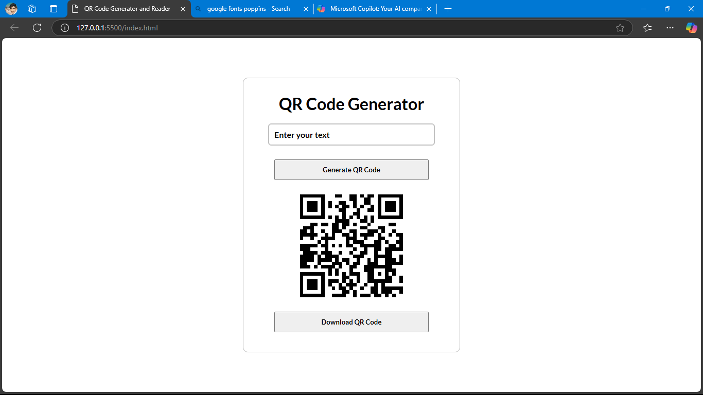

# QR Code Generator

This is a simple QR Code Generator built using HTML, CSS, and JavaScript. With this project, users can generate QR codes for any text input. Users can type text in the input box, click the "Generate QR Code" button to create a QR code, and use the "Download QR Code" button to save the generated QR code.

## Features

- **Generate QR Code**: Enter text in the input box to generate a QR code.
- **Download QR Code**: Download the generated QR code with a click of a button.

## How to Use

1. **Input Text**: Type your desired text into the input box.
2. **Generate QR Code**: Click on the "Generate QR Code" button to create the QR code.
3. **Download QR Code**: Click on the "Download QR Code" button to save the generated QR code to your device.

## Technologies Used

- **HTML**
- **CSS**
- **JavaScript**

## Setup

1. Clone the repository or download the ZIP file.
2. Open the `index.html` file in your preferred web browser.
3. Start generating and downloading QR codes!

## Screenshot

## Contributing

Feel free to fork this repository, create a new branch, and submit a pull request with your enhancements or bug fixes.

## License

This project is open-source and available under the MIT License.
